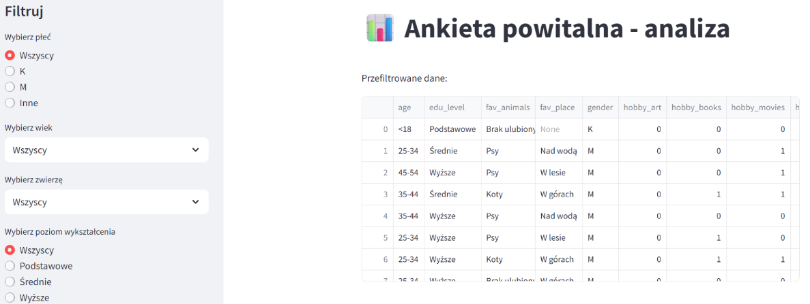
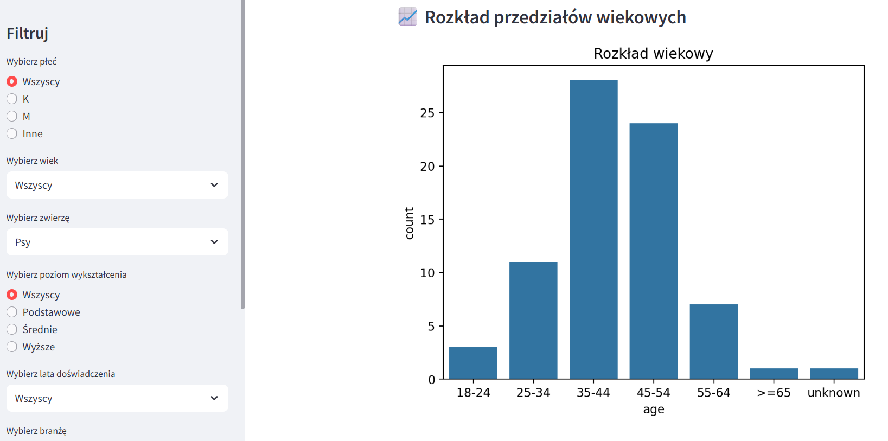
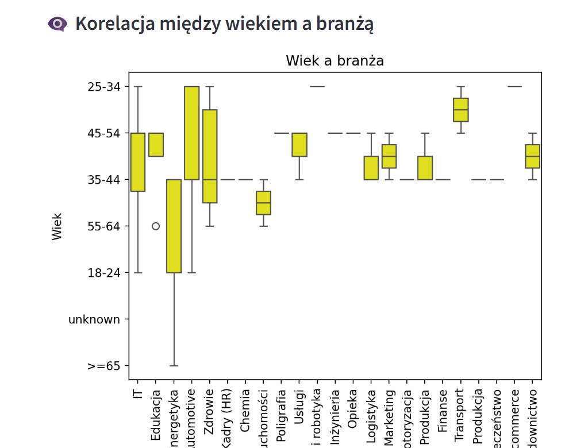
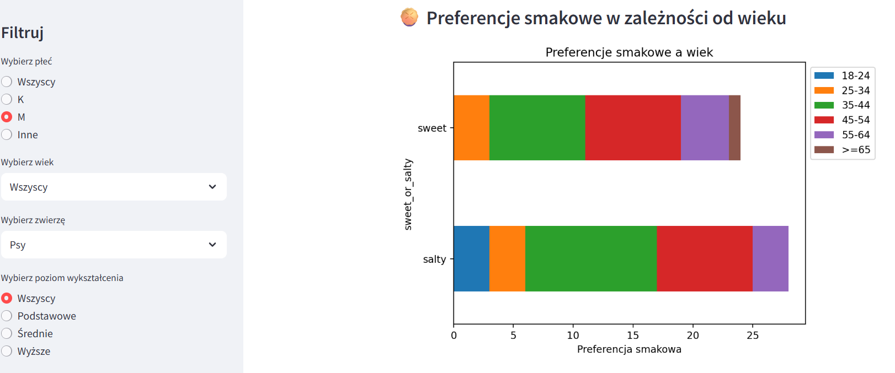
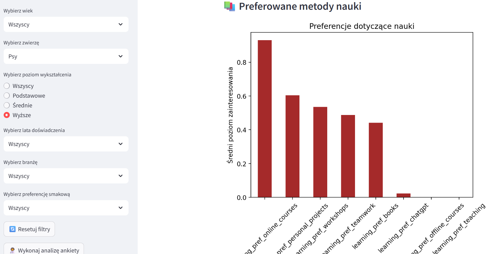

## Analiza ankiety powitalnej uczestników kursu "Od Zera do AI"
**_Data utworzenia_: kwiecień 2025**

W ramach kursu "Od Zera do AI" przeprowadzono krótką ankietę powitalną wśród uczestników. Celem było lepsze poznanie grupy — jej doświadczenia, preferencji oraz oczekiwań względem nauki. Na podstawie zebranych danych przygotowano interaktywną analizę, którą można filtrować według wybranych kategorii.

Analiza zakończona jest możliwością wygenerowania pełnego raportu w formacie HTML.

### Zakres filtrów w analizie:
- Płeć, Wiek
- Ulubione zwierzęta
- Poziom wykształcenia
- Lata doświadczenia zawodowego, Branża
- Preferencje smakowe

### Zawarte wizualizacje:
- Rozkład uczestników według przedziałów wiekowych
- Najpopularniejsze ulubione zwierzęta
- Korelacja między wiekiem a branżą
- Rozkład hobby w zależności od płci
- Preferencje smakowe w zależności od wieku
- Poziomy wykształcenia w grupie
- Preferowane metody nauki (np. wideo, tekst, praktyka)

### Link do projektu:        [Otwórz ankietę](https://ankietaapp.streamlit.app/)

### Przykładowe PrtSc:

<figure markdown="1">
  
</figure>

<figure markdown="1">
  
</figure>

<figure markdown="1">
  
</figure>

<figure markdown="1">
  
</figure>

<figure markdown="1">
  
</figure>