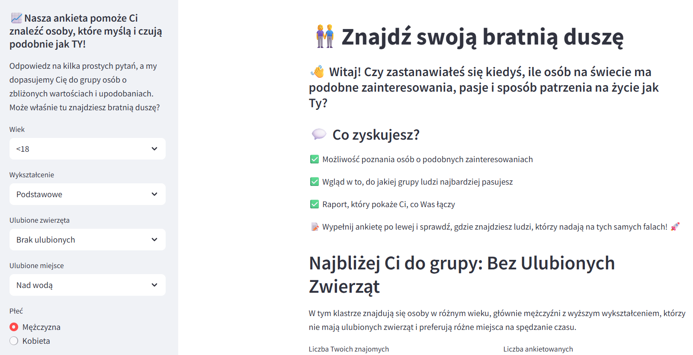
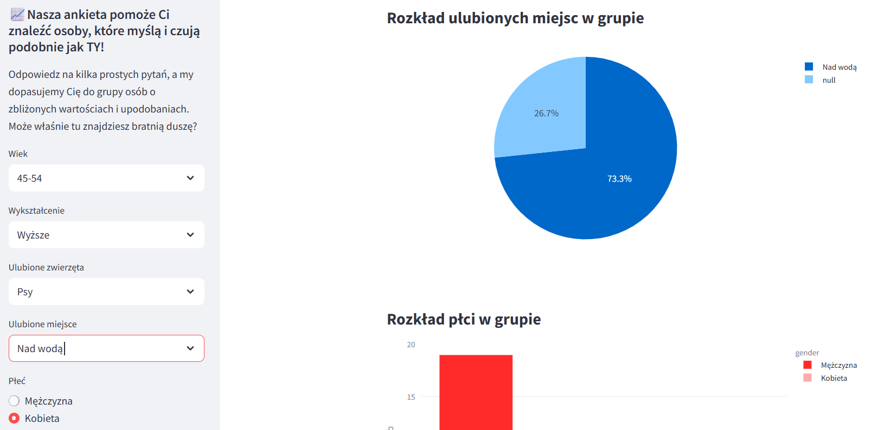
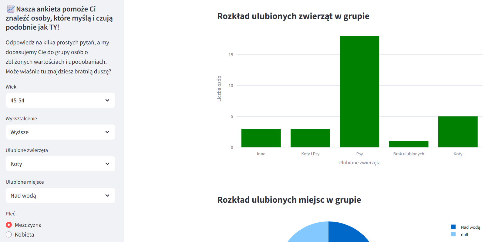

# APLIKACJA - Find Friends 
## "Kim jesteśmy? Interaktywna analiza odpowiedzi uczestników kursu Data Science"
_Data utworzenia_: kwiecień 2025

Prezentowana aplikacja stworzona w Streamlit umożliwia interaktywną eksplorację danych z powitalnej ankiety uczestników kursu. Dzięki niej w prosty sposób można analizować różnorodne aspekty, takie jak:

1. wiek, wykształcenie

1. zainteresowania, 

1. ulubione zwierzęta lub miejsce 

Intuicyjny interfejs pozwala na filtrowanie danych i wizualizację ciekawych zależności, co czyni aplikację przydatnym narzędziem zarówno do analizy trendów, jak i lepszego zrozumienia grupy odbiorców.

Model został wytrenowany na próbie liczącej 229 przypadków. 
Po lewej stronie aplikacji wybieramy dane ogólne (rozkład płci, wieku, wykształcenia) dotyczące naszej osoby lub osoby, którą chcemy poznać. Po prawej stronie ukazane są rozkłady preferencji - tzn. opis grupy do jakiej przynależy dana osoba, wykresy rozkładu wykształcenia, ulubionych miejsc, zwierząt oraz płci.

**Dodatkowo można również wydrukować i pobrać pełny raport jako HTML**.

### Link do aplikacji:   [Otwórz aplikację](https://findfriends-3wj3zmfmuofrjmueakdmta.streamlit.app/)

### Przykładowe PrtSc:

<figure markdown="1">
  
  <figcaption>Informacja o ankiecie</figcaption>
</figure>

<figure markdown="1">
  
  <figcaption>Przykład 1</figcaption>
</figure>

<figure markdown="1">
  
  <figcaption>Przykład 2</figcaption>
</figure>
