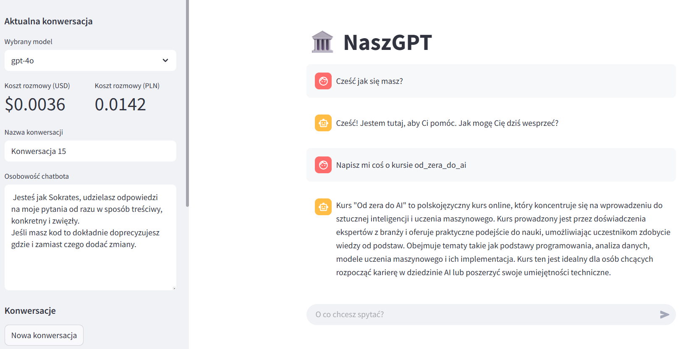

### 💬 NaszGPT – Osobisty Asystent AI z Osobowością, GUI i Świadomością Kosztów
_Data utworzenia_: marzec 2025

**Technologie**: Python, Streamlit, OpenAI API, GPT-4o, GPT-4o-mini, .env, JSON, Markdown

### 📌 Opis projektu:

NaszGPT to niestandardowa aplikacja AI – lekki, osobisty asystent oparty na ChatGPT, zaprojektowany z myślą o użytkowniku końcowym. Łączy w sobie naturalność rozmowy, kontrolę nad kosztami i prosty interfejs graficzny dzięki Streamlit.

### 🚀 Kluczowe funkcje:

✅ Osobowość i pamięć kontekstowa
Asystent posiada jasno zdefiniowaną osobowość oraz pamięć kontekstową w ramach sesji – dzięki temu rozmowy są bardziej ludzkie i spersonalizowane.

✅ Świadomość kosztów (cost-awareness)

Śledzi zużycie tokenów (dla zapytań i odpowiedzi)

Wyświetla szacunkowe koszty rozmowy na bieżąco

Pomaga użytkownikowi kontrolować wydatki przy korzystaniu z modeli OpenAI

✅ Integracja z OpenAI API

Wspiera najnowsze modele GPT, w tym GPT-4o i GPT-4o-mini

Konfiguracja przy pomocy prostego pliku .env

Łatwa adaptacja do różnych typów kont i kluczy API

✅ Zarządzanie rozmowami

Rozmowy zapisywane lokalnie w folderze rozmowy

Możliwość przeglądania i wczytywania poprzednich sesji

Format zapisu: .md (Markdown) lub .json – łatwe do synchronizacji lub analizy

✅ Interfejs użytkownika (GUI) w Streamlit

Intuicyjny, lekki interfejs webowy

Obsługa rozmów, historii, konfiguracji i monitorowania kosztów z poziomu przeglądarki

### 🎯 Cel projektu:

Stworzyć prostego w obsłudze, prywatnego asystenta AI, który nie tylko „rozmawia jak człowiek”, ale też dba o koszty i umożliwia pełną kontrolę nad sesjami. Idealne narzędzie dla osób chcących korzystać z mocy GPT lokalnie, bez zbędnego przeładowania.

[Link do repozytorium](https://github.com/Alice395136/naszgpt_langfuse.git)

### Przykładowy zrzut:

<figure markdown="1">
  
  <figcaption>Przykładowa konwersacja</figcaption>
</figure>